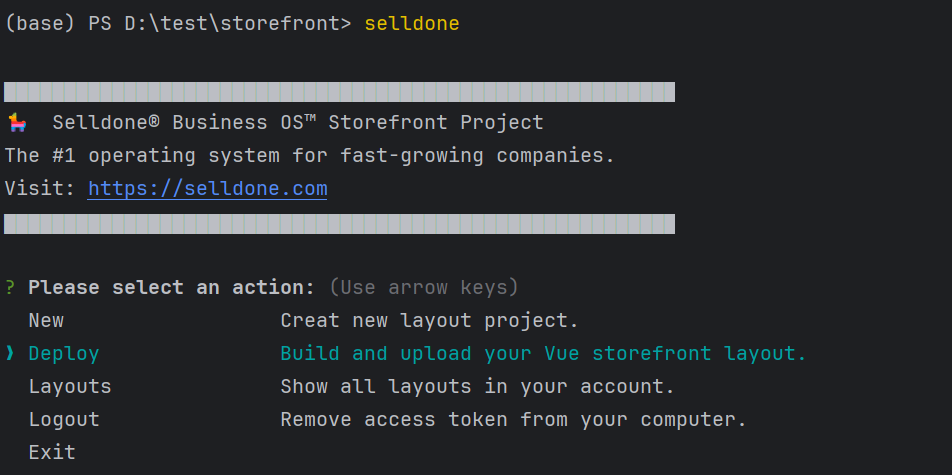
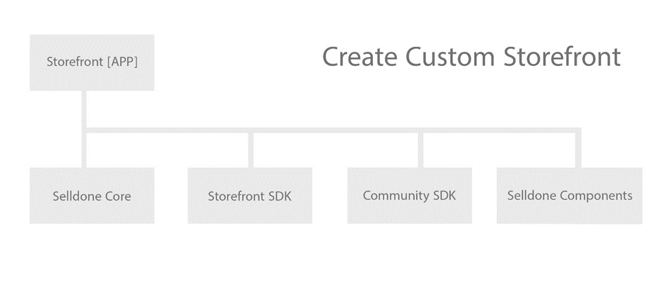
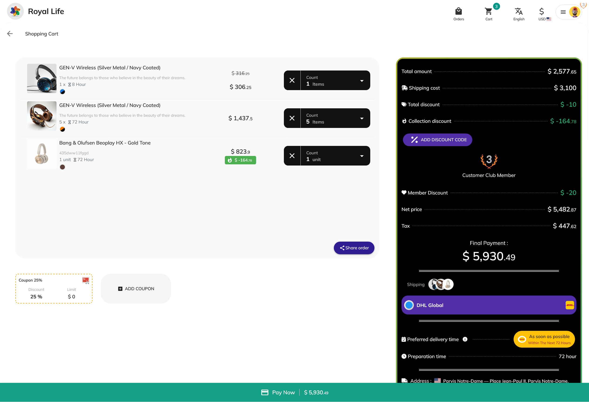

[](https://app.codacy.com/gh/selldone/storefront/dashboard?utm_source=gh&utm_medium=referral&utm_content=&utm_campaign=Badge_grade)


## Selldone ⮕ Storefront Official

_Ready to build project!_

* **Mode:** 🌍 Public
* **Use case:** To build a fully-functional storefront for customers.
* **Project Type:** Full Project
* **Framework:** Vue


## Manifesto: Celebrating Business Uniqueness

In a world teeming with commerce, every business stands distinct. Each has its own story, ethos, and vision that sets it
apart. It's not just about selling products or services; it's about conveying an identity, a unique essence that
resonates with its audience.
Page builders, while convenient, often confine businesses within the boundaries of templates and pre-defined designs.
Their inherent limitations can stifle the true spirit of a brand, preventing it from shining in its full, authentic
glory.

We recognize this challenge. And
so, [we've chosen to disrupt the status quo of e-commerce](https://selldone.com/blog/the-next-generation-of-founders-is-not-just-technical-147).
We believe in empowering
businesses, big or small, to showcase their uniqueness without barriers. By offering pre-made components that are fully
open-source, we're unlocking a realm of limitless customization. No more compromises. No more settling for the 'almost
right' look.

With our tools, businesses can now tailor their digital presence down to the finest detail, all without the headaches of
technical complexities. We're not just offering a solution; we're championing a movement. A movement where every
business gets to be unabashedly itself, where every brand narrative is told just as it should be.

**Because in uniqueness, there's power. And we're here to unleash it.**

## Live Preview

| Page             | URL                                                                                       |
|------------------|-------------------------------------------------------------------------------------------|
| Product Page     | https://marketplace.hanscristy.com/product/238246-gen-v-wireless-silver-metal-navy-coated |
| Landing Page     | https://marketplace.hanscristy.com/                                                       |
| Products Listing | https://marketplace.hanscristy.com/shop                                                   |
| Products Filter  | https://bigmart.me/printful-category                                                      |

## What is LAYOUT?

Selldone, positioned as a cutting-edge and **avant-garde e-commerce platform**, has eliminated the traditional concepts
of '**templates**' and '**plugins**' due to their drawbacks such as instability, high costs, security vulnerabilities,
susceptibility to crashes, and bug-proneness. Instead, Selldone introduces the concept of **`LAYOUT`**. A Layout in
Selldone is a **fully independent web application** that operates seamlessly on the **Selldone infrastructure**. It is
designed to be **fully customizable** and is **open source**, offering a more robust and flexible solution for
e-commerce needs.


## How to start

_Guide to Getting Started with Storefront Project (Vue Framework) for Selldone_

Create a fully customized storefront for Selldone using the Storefront Project built on the Vue framework. Follow these
simple steps to get started:

### Setting Up Your Development Environment

#### Step 1: Clone the Storefront Project

First, clone the project to your local machine using the following command:

```shell
gh repo clone selldone/storefront
```

#### Step 2: Install Necessary Packages

Next, install all the required packages. You can use either Yarn or npm as your package manager.

If you're using Yarn, run:

```shell
yarn install
yarn setup
```

For npm, use:

```shell
npm install
npm setup
```

#### Step 3: Begin Development

Now, you're ready to start developing your storefront. To launch the development server, use one of the following
commands:

With Yarn:

```shell
yarn serve --https
```

With npm:

```shell
npm serve --https
```

Open served address: e.g. `https://localhost:8080/`

### Configuring Your Storefront

#### Manifest File (`manifest.json`)

To publish your storefront on Selldone and make it available for use, configure your layout settings in
the `manifest.json` file. This step is crucial for personalizing and defining the structure of your storefront.

#### Test Environment (`.env` File)

For a realistic development experience, your project will use data from an actual Selldone store. To set this up, modify
the `.env` file with the following variables:

| Variable                        | Description                                                                                                                                                          | Example   |
|---------------------------------|----------------------------------------------------------------------------------------------------------------------------------------------------------------------|-----------|
| VUE_APP_SAMPLE_SHOP_NAME        | Your Selldone shop name. Use the format `my-shop-name`.                                                                                                              | toysworld |
| VUE_APP_SAMPLE_SHOP_CUSTOM_HOME | Define the first page of your storefront. Options include `blog`, `avocado`, `hyper`, `community`, `shop`, `map`, `number`, a specific _LANDING-PAGE-ID_, or `null`. | 3001      |

By following these steps, you'll be well on your way to developing a unique and fully customized storefront for Selldone
using the Vue framework. Happy coding!


## Deploy

Install `Selldone-CLI` globally:
```shell
npm install -g selldone-cli
```

Run `Selldone-CLI` to deploy:
```shell
selldone
```

CLI: https://www.npmjs.com/package/selldone-cli

[](https://www.npmjs.com/package/selldone-cli)


## Developer Panel
Access the developer panel to manage your layouts here: [**Selldone Developer Layouts**](https://selldone.com/developer/layouts).

## Monetization 🤑

You can generate income by crafting storefronts for various verticals using Selldone and then publishing them directly
on Selldone. Alternatively, you have the option to develop a SaaS (Software as a Service) on your own servers and
provide the service from there. By opting to publish on Selldone, you gain the opportunity to market your LAYOUTs either
through a one-time purchase or a subscription-based model. For instance, developers can create a storefront specifically
designed for influencers and offer their LAYOUT for a monthly subscription fee of $599 on Selldone.

## Needed Modules



| Module                                                          | Description                                                                                     |
|-----------------------------------------------------------------|-------------------------------------------------------------------------------------------------|
| [Selldone Core](https://github.com/selldone/core)               | SDK contains APIs and necessary files to interact with Selldone servers.                        |
| [Storefront SDK](https://github.com/selldone/storefront-sdk)    | SDK for building and managing the storefront interface.                                         |
| [Selldone Components](https://github.com/selldone/components)   | Contains all pre-built and professional commerce components to build storefront and backoffice. |
| [Vendor SDK](https://github.com/selldone/vendor-sdk)            | SDK tailored for vendors to integrate and manage their offerings.                               |
| [Community SDK](https://github.com/selldone/community-sdk)      | Community-driven SDK with additional tools and integrations.                                    |
| [Selldone Pagebuilder](https://github.com/selldone/pagebuilder) | Tool for building and customizing pages within the Selldone platform.                           |

Command to update modules (fetch from git) : `git submodule update --remote --merge`

### Native app login

* Query to load native mode: native ex. ?native=true
* Query login app: /login?app=selldone.com.... (Custom URI in the app)

## Storefront - 🌟 `This project`

This is the project at hand: the open-source Selldone storefront. With it, you can craft a fully customizable storefront
tailored to your business and branding requirements. Integrate it seamlessly into your website created by Selldone with
just a single 'publish' command!

### Product Page


### Cross-selling & Upselling


### Pickup


### Custom Layout


### Pickup


### Support Gift shopping


### Smart Suggestions


### Dynamic Listing View


### Filter Products


### Checkout



## Backoffice - `Free cloud panel`

You can either manage your business using the ready-made cloud dashboard on selldone.com or construct a completely
bespoke management dashboard using the pre-built backoffice SDK and components.

### Dashboard


### Products


### Orders


### Fulfillment


### Order timeline


---

## License

**Selldone Ecosystem License Agreement**

1. **Scope of License**: This license is granted exclusively for the use of the enclosed code (hereinafter referred to
   as "the Code") within the Selldone ecosystem. The licensee is authorized to use the Code solely in conjunction with
   services and applications that are part of, or directly related to, the Selldone ecosystem.

2. **Commercial Use Restriction**: The licensee is strictly prohibited from using the Code for any commercial purposes
   outside the Selldone ecosystem. Commercial utilization is permissible only when it is within the Selldone ecosystem
   and in accordance with the terms of this agreement.

3. **Permission for Free Use**: The Code may be used for non-commercial, free services, provided that explicit credit is
   given to Selldone. This credit must include the name "Selldone" prominently displayed on the user interface of the
   relevant service or application, along with a hyperlink to [selldone.com](https://selldone.com).

4. **No Redistribution**: The licensee may not redistribute the Code, in whole or in part, to any third party outside
   the Selldone ecosystem, unless expressly authorized by Selldone.

5. **No Modification for Redistribution**: While modifications to the Code for personal or internal use within the
   Selldone ecosystem are allowed, the licensee may not modify the Code for the purpose of redistribution outside the
   Selldone ecosystem.

6. **Termination**: Failure to comply with the terms of this agreement will result in the immediate termination of the
   license and may subject the licensee to legal action.

7. **Disclaimer of Warranty**: The Code is provided "as is" without any warranties of any kind, either expressed or
   implied, including but not limited to implied warranties of merchantability or fitness for a particular purpose.

8. **Limitation of Liability**: In no event shall Selldone be liable for any damages arising out of the use or inability
   to use the Code.

9. **Jurisdiction and Disputes**: This agreement shall be governed by the laws of the jurisdiction where Selldone is
   established. Any disputes arising from this agreement shall be resolved in the courts of that jurisdiction.

By using the Code, the licensee acknowledges that they have read, understood, and agreed to the terms of this license.

---